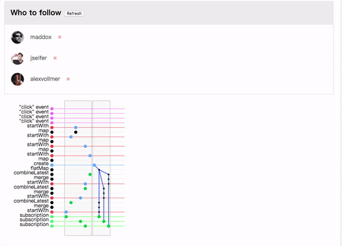
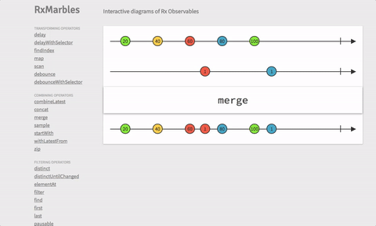

# RxJS 可视化工具推荐

> 本文为 [RxJS 中文社区](https://github.com/RxJS-CN) 原创文章，如需转载，请注明出处，谢谢合作！ 


## 前言
 RxJS 是前端目前为止响应式编程的最佳实践。很不幸的是我们已经用传统方式开发很多年了，“evething is stream” 的思想对我们来说不再是顺其自然，甚至会有一点蹩脚，尤其是初入 RxJS 的坑。毕竟，有个伟人说过，‘工欲善其事必先利其器’，不是吗？因此，我们给大家推荐三款可视化的神器，帮助大家对 RxJS 进行感性的了解。

## [rxViz](https://github.com/moroshko/rxviz)
  
  这款可视化工具是由 facebook 的 Misha Moroshko 开发。rxviz 可以简洁的可视化给定的 Observable. 你提供的 RxJS 代码会被执行，如果最后一个表达式是 Observable， 一个带着动画的可视化会出现在眼前。同时，你可以通过修改时间窗口来控制动画的速率，也可以将可视化 svg 复制下来用于你想用的地方，你同样可以将可视化分享给其他人。

   
  case 1: 针对简单 Observable:
  ```js
    Rx.Observable
      .interval(1000)
      .take(4)
  ```
  可视化效果为：
    <p>
        
    </p>
    
   case 2: 针对复杂高阶 Observable:

  ```js
    Rx.Observable
      .interval(1000)
      .groupBy(n => n % 2)
  ```

  可视化效果为：
    <p>
        
    </p>

    case n: 还可以可视化自定义的操作符等等，本文就不一一赘述了，大家可以去主页自己把玩。

  这个项目第一个 commit 是6月7号提交的，到现在刚过一个月多点，截止目前，47个 commit, 所以它还是一个很年轻的库，难免还不太完善。但是我们有理由相信，随着时间的流逝和社区的努力，这个库会越来越完善。
  
  总之，rxviz 是一款很适合 RxJS 的可视化工具。

## [rxVision](https://github.com/jaredly/rxvision)
 
  推荐这款 rxvision 可视化的工具时，我的内心是纠结的。个人来讲，我非常喜欢它，但是，尴尬的是作者已经不维护了，擦。但是，它还有一个不得不推荐的理由。请容我慢慢道来。

  相信[这篇文章](https://gist.github.com/staltz/868e7e9bc2a7b8c1f754)是所有前端响应式的殿堂级入门文章，中文也有人翻译再加工过。文章中的例子，也是经典，详细阐述了如何用“响应式”的思想构建业务逻辑，而 rxvision 对这个例子进行了可视化，没错，是下图这个样子的。
    <p>
        
    </p>

  所以，我们可以结合[这篇文章](https://gist.github.com/staltz/868e7e9bc2a7b8c1f754) 和 rxvision 更好的理解 RxJS 的开发模式。

## [rxMarbles](https://github.com/staltz/rxmarbles)

  这个库不得不推荐啊，这是响应式大神 staltz 的作品。和前面库最大的不同是, Observable 的每个 item 是可交互的，你可以拖拽，然后整个 Observable 都会做出相应的改变。如下图说示：

  <p>
        
  </p>


## 结论
 
可以在学习 RxJS 的时候，结合这些可视化的工具，相信会达到事半功倍的效果。


