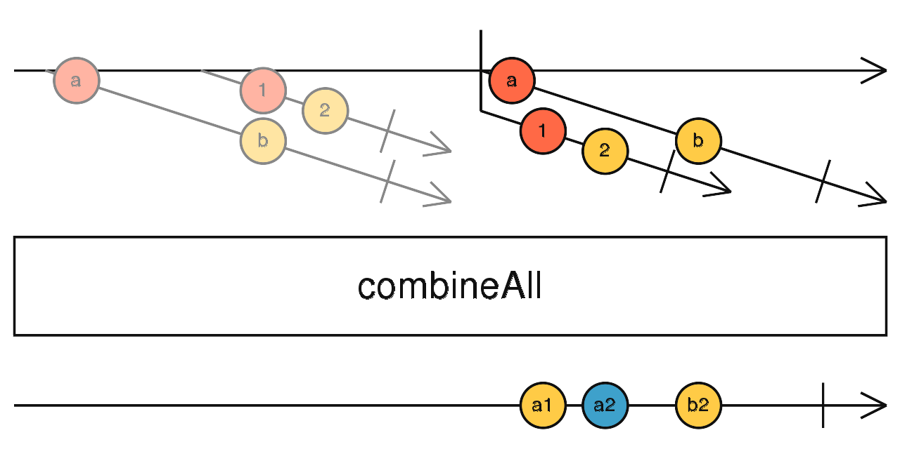
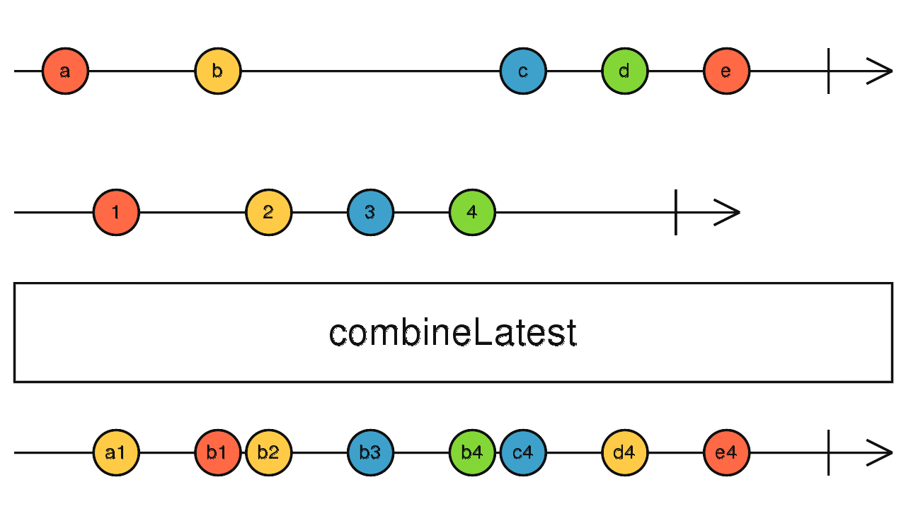

# 白话操作符---(组合系列)

> 组合系列在操作符中占有浓墨重彩的一笔。如果我们将 “流” 抽象为一个业务单元，则通过组合可以将多个业务单元之间进行了交互，从而可以实现更复杂的逻辑。

## combineAll

    

> 最外层(主干)必须是一个有限流。主干发出的不是普通数据而是子流。将所有的子流 combinLatest.

> 适用场景: 有点两层循环的感觉。重点在于第二层流。现在想到可能的应用场景有: 最外层是一个点击流，只取前5个，将点击流发出的事件对象映射为业务流，然后就可以时时看到5个业务流的发出数据。

## combineLatest

    

> 多个同一层的流。将这些流按数组的方式组合起来，类似于 [stream1, stream2, stream3]。当所有流都发出数据，结果流才开始发出数据。紧接着，任何一个流发出新的数据，结果流组合每个流的罪新的数据返回。

> 适用场景: 关心每个业务流的最新值。

## concat

    

> 这个比较简单，就是所有流按顺序执行，串行的。

> 适用场景: 按顺序执行每个业务流。

